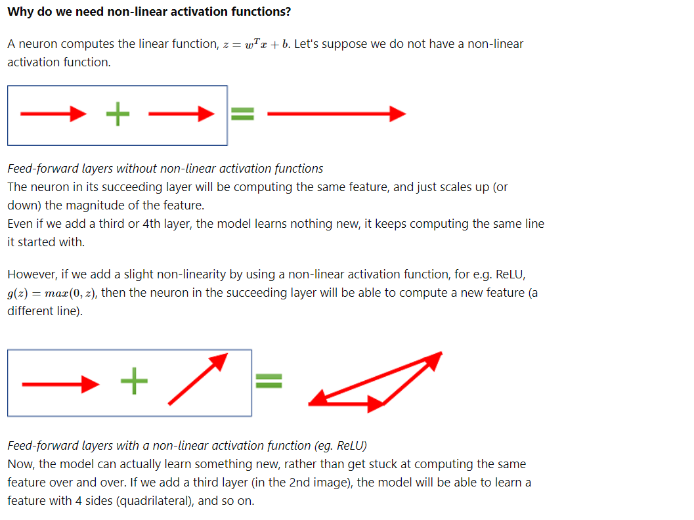

## Study Guide

#### Topics
1. Transformers
2. Encoder-decoder
3. Self-attention
4. Feedforward
5. Softmax
6. 

#### Questions
1. What are Transformers in the context of machine learning?
1. What are the sub-layers within each encoder and decoder of the Transformer, and how do they function?
1. How are input words processed in the Transformer model?
1. How are transformers different from previous sequence models like RNNs and LSTMs?
2. Can you describe the historical development of Transformer models? When were they introduced, and what were the key advancements they brought?
3. Explain the basic architecture of a Transformer model, highlighting the roles of the encoder and decoder.
4. What is self-attention in Transformers, and how does it differ from traditional attention mechanisms?
6. Can you explain the concept of multi-head attention in Transformers and its benefits?
7. Describe the feed-forward networks in Transformer models. What is their role?
8. What are layer normalization and dropout in the context of Transformers, and why are they used?
9. How are Transformers trained, especially considering their parallelizable architecture?
10. What are some common applications and tasks where Transformer models are particularly effective?
1. What are Query, Key, and Value vectors in the context of self-attention, and how are they used?
1. What is the difference between Query, Key matrices and the Value Matrix?
1. What is the mathematical transformation that the Key and Query matrix? are doing and why is it useful?
1. Describe the steps involved in the calculation of self-attention.
1. How does the Transformer model use matrix operations in self-attention calculation?
1. What is multi-headed attention in the Transformer model, and what are its advantages?
1. How does positional encoding work in the Transformer model?
1. What role do residual connections and layer normalization play in the Transformer model?
1. Explain the role of the decoder in the Transformer model.
1. Describe the final linear and softmax layers in the Transformer's decoder.
1. What are the three ways to calculate similarity?
1. What is the role of the loss function during training?
3. What is the role of self-attention in a Transformer model?
4. How does the Transformer model handle positional information?
1. What is positional encoding?
1. What is softmax?
1. What parts of a transformer uses softmax and why?
1. What is the significance of using multiple encoders and decoders in the Transformer model?
1. How does the Transformer model handle long-range dependencies in sequences?
1. Explain the importance of layer normalization in the Transformer architecture.
1. Describe the training process of the Transformer model in terms of data requirements and computational efficiency.
5. Explain the multi-head attention mechanism in Transformers.
6. How does the GPT (Generative Pre-trained Transformer) architecture differ from the standard Transformer model?
7. Can you describe the process of training a Transformer model like GPT?
8. What are some challenges in implementing Transformers at scale?
1. Explain the difference between static and dynamic word embeddings.
1. How do Transformer models utilize layers to process word embeddings?
1. Describe the process and significance of the self-attention mechanism in Transformer models.
1. In the context of next-word prediction, how does a model like GPT-4 generate a new word?
1. What happens to the word embeddings when a new word is generated and added to the sentence in a language model?
1. Explain the role of dimensionality in word embeddings and why high-dimensional spaces are used.
1. Discuss the computational challenges in managing dynamic embeddings in large-scale models like GPT-4.

### AI/ML

1. What are Transformers in the context of machine learning?
**Expected Answer** : Transformers are a type of deep learning model that primarily uses self-attention mechanisms to process sequential data. Unlike previous models like RNNs and LSTMs, Transformers handle sequences in parallel, which allows for more efficient training and better handling of long-range dependencies.
1. What are the sub-layers within each encoder and decoder of the Transformer, and how do they function?
**Expected Answer**: Each encoder in the Transformer model consists of two sub-layers: a self-attention layer and a feed-forward neural network. The self-attention layer allows the encoder to consider other words in the input sentence for better word encoding. The feed-forward network processes the output of the self-attention layer. Decoders also have these layers, with an additional attention layer to focus on relevant parts of the input sentence​​.
1. How are input words processed in the Transformer model?
**Expected Answer**: In the Transformer model, each input word is converted into a 512-dimensional vector using an embedding algorithm. This embedding happens in the bottom-most encoder, and each encoder receives a list of such vectors, either as word embeddings or as outputs from the previous encoder
1. How are transformers different from previous sequence models like RNNs and LSTMs?
**Expected Answer**: Transformers are a type of deep learning model designed to handle sequential data, primarily using self-attention mechanisms. Unlike RNNs and LSTMs, which process data sequentially, Transformers process entire sequences in parallel, allowing for more efficient training and better handling of long-range dependencies.
2. Can you describe the historical development of Transformer models? When were they introduced, and what were the key advancements they brought?
**Expected Answer**: Transformers were introduced in 2017 by Vaswani et al. in the paper "Attention Is All You Need." The key advancements included the introduction of the self-attention mechanism, which allowed for parallel processing of sequences and better handling of long-range dependencies, marking a significant departure from the RNN and LSTM models.
3. Explain the basic architecture of a Transformer model.
**Expected Answer**: The basic architecture of a Transformer includes an encoder and a decoder. The encoder processes the input data and the decoder generates the output. Each consists of layers that include self-attention mechanisms and feed-forward neural networks. The encoder captures the context of the input sequence, while the decoder uses this context to produce the output sequence.
4. What is self-attention in Transformers, and how does it differ from traditional attention mechanisms?
**Expected Answer**: [Self-attention](Models/self-attention.md), a key component of Transformers, allows each position in the sequence to attend to all positions in the previous layer of the model, thus enabling parallel processing. It differs from traditional attention mechanisms by focusing on different parts of the same input sequence to compute the representation.
1. What are the three ways to calculate similarity?
**Expected Answer**: Dot product, Cosine similarity, Scaled dot product.
6. Can you explain the concept of multi-head attention in Transformers and its benefits?
**Expected Answer**: Multi-head attention splits the attention mechanism into multiple heads, allowing the model to simultaneously attend to information at different positions and from different representational spaces. This enables the model to capture a richer understanding of the input.
7. Describe the feed-forward networks in Transformer models. What is their role?
**Expected Answer**: Each layer of a Transformer contains a feed-forward network, which applies two linear transformations and a ReLU activation in between. These networks are position-wise, meaning they operate on each position independently and identically. Their role is to process the output of the attention layer and introduce non-linearity into the model.
8. What are layer normalization and dropout in the context of Transformers, and why are they used?
**Expected Answer**: Layer normalization and dropout are techniques used to stabilize and regularize training in Transformers. Layer normalization helps in stabilizing the hidden state dynamics in deep networks, while dropout prevents overfitting by randomly setting a fraction of the input units to zero at each update during training.
9. How are Transformers trained, especially considering their parallelizable architecture?
**Expected Answer**: Transformers are trained using backpropagation, similar to other deep learning models. Their parallelizable architecture allows for efficient training on large datasets, as they can process entire sequences simultaneously rather than sequentially.
10. What are some common applications and tasks where Transformer models are particularly effective?
**Expected Answer**: Transformer models have been highly effective in various natural language processing tasks such as language translation, text generation, summarization, and question-answering. They are also being adapted for applications in other domains like image processing and music generation.
1. What are Query, Key, and Value vectors in the context of self-attention, and how are they used?
**Expected Answer**: In self-attention, each word's embedding is used to create three vectors: Query, Key, and Value. These vectors are generated by multiplying the embedding by trained matrices. They are instrumental in calculating attention, where the dot product of the Query vector of one word with the Key vector of another determines the attention score, reflecting the importance of other words when encoding a specific word
1. What is the difference between Query, Key matrices and the Value Matrix?
**Expected Answer**: The Query and Key matrices are used to manipulate the space the embeddings are mapped to in order to get a better similiarity calculation for the words. The Query and Key are trained with the model to maximize for similarity, but what works best for similarity is not good for calculating the next best word. That is where the Value matrix comes in as it then takes the best of the similarity calculations and maps it on the Value matrix to then generate the best next word. The Value matrix like the Query and Key matrix are trained for these specific purposes.
1. What is the mathematical transformation that the Key and Query matrix? are doing and why is it useful?
**Expected Answer**: Linear transformation. It is important because it transform the vector space that represents the embeddings to better find similarity. By using the Key and Query matrix / vector to map the words it will maximize the similarity calculation which provides context and better relationships that improves the models calculation of the next word. 
1. Describe the steps involved in the calculation of self-attention.
**Expected Answer**: The calculation of self-attention involves several steps:

   * Create Query, Key, and Value vectors for each word.
   * Calculate attention scores using the dot product of Query and Key vectors.
   * Normalize the scores using softmax to ensure they add up to 1.
   * Multiply each Value vector by its softmax score, then sum them up to produce the self-attention output for each word

1. How does the Transformer model use matrix operations in self-attention calculation?
**Expected Answer**: In the Transformer, self-attention calculations are efficiently executed using matrix operations. Query, Key, and Value matrices are formed by multiplying the input embedding matrix with trained weight matrices. These matrix operations enable the model to process all words simultaneously, leading to faster computation​​.

1. What is multi-headed attention in the Transformer model, and what are its advantages?
**Expected Answer**: Multi-headed attention is an extension of the self-attention mechanism where the model uses multiple sets of Query/Key/Value weight matrices. This approach allows the model to focus on different positions and representation subspaces, enhancing its ability to capture various aspects of the input sequence. Each head contributes to a more comprehensive representation of the input​​. The idea behind multi-head attention is to allow the attention function to extract information from different representation subspaces, which would otherwise be impossible with a single attention head

1. Describe the process in which mult-headed attention works?
**Expected Answer**: 

1. What is the multi-head attention function representation?
**Expected Answer**: $$multihead(\mathbf{Q}, \mathbf{K}, \mathbf{V}) = concat(head_1, \dots, head_h) \mathbf{W}^O$$

1. What is the single attention function characterized by its own learned projection matrices?
**Expected Answer**: $$\text{head}_i = \text{attention}(\mathbf{QW}^Q_i, \mathbf{KW}^K_i, \mathbf{VW}^V_i)$$

1. What is the step-by-step procedure for computing multi-head attention?
**Expected Answer**:

   1. Compute the linearly projected versions of the queries, keys, and values through multiplication with the respective weight matrices for each head: $\mathbf{W}^Q_i , \mathbf{W}^K_i , \mathbf{W}^V_i $
   2. Apply the single attention function for each head by (1) multiplying the queries and keys matrices, (2) applying the scaling and softmax operations, and (3) weighting the values matrix to generate an output for each head.
   3. Concatenate the outputs of the heads: $\text{head}_i , i = 1, \dots, h$
   4. Apply a linear projection to the concatenated output through multiplication with the weight matrix, $W^O$ to generate the final result

1. How does positional encoding work in the Transformer model?
**Expected Answer**: Positional encoding is used in the Transformer to account for the order of words in the input sequence. Each input embedding is added with a positional encoding vector, which follows a specific pattern learned by the model. This process provides information about the position of each word and the relative distances between words in the sequence​​.

1. What role do residual connections and layer normalization play in the Transformer model?
**Expected Answer**: In the Transformer model, each sub-layer (both self-attention and feed-forward neural network) in the encoders and decoders includes a residual connection around it, followed by layer normalization. Residual connections help in mitigating the vanishing gradient problem, and layer normalization ensures that the data in each layer has a consistent distribution, which aids in stable and efficient training​​.

1. Explain the role of the decoder in the Transformer model.
**Expected Answer**: The decoder in the Transformer model utilizes the outputs from the encoder stack to generate the output sequence. It includes self-attention layers, which attend to previous positions in the sequence, and encoder-decoder attention layers, which focus on relevant parts of the input sequence. The decoder processes each word in the output sequence, leveraging the information and context provided by the encoder​​.

1. Describe the final linear and softmax layers in the Transformer's decoder.
**Expected Answer**: The final linear layer in the Transformer's decoder is a fully connected neural network that projects the decoder output into a logits vector, representing the scores for each word in the model's vocabulary. The softmax layer then converts these scores into probabilities. The word with the highest probability is selected as the output for that position in the sequence​​.

1. What is the role of the loss function during training?
**Expected Answer**: The loss function measures the difference between the model's output and the actual output, guiding the model to adjust its parameters for more accurate predictions. Different decoding strategies like greedy decoding and beam search can be used during training to select the most likely words for the output sequence

3. What is the role of self-attention in a Transformer model?
**Expected Answer**: Self-attention allows the model to focus on different parts of the input sequence when processing a specific part of that sequence. It computes attention scores to decide how much focus to put on other parts of the input when encoding or decoding a particular part.
4. How does the Transformer model handle positional information?
**Expected Answer**: Transformers use positional encodings to maintain the order of the sequence. These encodings are added to the input embeddings to provide the model with information about the position of each element in the sequence. 

1. What is positional encoding?
**Expected Answer**: Position encodings are added to the input embeddings at the bottom of the Transformer model. These encodings can take different forms, but they all serve the same purpose: to give the model a way to infer the order of the sequence elements. Transformers process all elements simultaneously (in parallel), so they don't have a way of recognizing the order of elements unless this information is explicitly provided. The reason this is important is because if we had the sentence `write a story.` and then another sentence `a . story write` we can see that these are two distinct sentence with the second one being nonsense. However, without positional encoding they would end up as the same vector representation and lack the context of position. This is accomplished by adding some sequence to the word embeddings in order to move them around to perturb the order.

1. What is softmax?
**Expected Answer**: Softmax is a function that takes a vector of values and returns a vector of values between 0 and 1, where the sum of the values is 1. It’s a nice way of obtaining probabilities. . In the case of transformers the function is: $$\frac{e^{x}}{d_k}$$

1. What parts of a transformer uses softmax and why?
**Expected Answer**: 
   * Attention Mechanism: attention scores are calculated using the softmax function on scaled dot products of queries and keys. This scaling helps in stabilizing the gradients during training. The softmax function here converts these raw scores into a probability distribution, indicating the relative importance of each value in the input sequence
   * Softmax in Output Layer: softmax is also commonly used in the output layer of Transformers for tasks like classification and language modeling. It provides a probability distribution over possible output tokens (e.g., words in language models), aiding in the generation of coherent and contextually relevant text.

1. What is the significance of using multiple encoders and decoders in the Transformer model?
**Expected Answer**: The use of multiple encoders and decoders in the Transformer model allows for a deeper level of processing and understanding of the input and output sequences. Each encoder and decoder layer adds a level of abstraction, enabling the model to capture more complex patterns and relationships within the data. This stacking of layers contributes to the model's ability to handle complex translation tasks and understand the nuances of language.

1. If we have an 8 heads and 2 encoders in our transformer, explain the input and output of each encoder layer
**Expected Answer**: The word embeddings that are then added to the positional matrix to represent our input is what is passed into the first encoder. The output of the first encoder will be the the resulting concatenation of the attention calculation with the feedforward layer. That output will be the input of second encoder and will follow the same pattern.

1. Is the word embedding matrix used after the first encoder layer?
**Expected Answer**: No

1. How does the Transformer model handle long-range dependencies in sequences?
**Expected Answer**: The Transformer model effectively handles long-range dependencies through its self-attention mechanism. Unlike RNNs or LSTMs, which process sequences linearly and may struggle with long-range dependencies, the Transformer's self-attention allows each word in the sequence to directly attend to every other word. This direct attention mechanism enables the model to capture relationships and dependencies between words, regardless of their position in the sequence.

1. Explain the importance of layer normalization in the Transformer architecture.
**Expected Answer**: Layer normalization is crucial in the Transformer architecture as it stabilizes the learning process. By normalizing the inputs across the features, layer normalization ensures that the data within each layer has a consistent mean and variance. This standardization reduces training time and improves the overall performance of the model by mitigating issues related to varying scales of features and the internal covariate shift problem.

1. Why do we use ReLU as the activation function, where is it used in the transformer and how does it improve the model?
**Expected Answer**: 

1. Describe the training process of the Transformer model in terms of data requirements and computational efficiency.
**Expected Answer**: The training of the Transformer model requires a substantial amount of labeled data for effective learning. This data is used in a supervised learning setting, where the model's predictions are compared against actual outputs to compute the loss. The Transformer's parallelizable architecture makes it computationally efficient, especially when trained on hardware like GPUs or TPUs. This efficiency is largely due to the model's ability to process multiple parts of the sequence simultaneously, unlike sequential models like RNNs.

5. Explain the multi-head attention mechanism in Transformers.
**Expected Answer**: Multi-head attention in Transformers involves splitting the attention mechanism into multiple heads. Each head focuses on different parts of the input, allowing the model to capture various aspects of the information. This parallel processing leads to a more comprehensive understanding of the input.
6. How does the GPT (Generative Pre-trained Transformer) architecture differ from the standard Transformer model?
**Expected Answer**: GPT is a variant of the Transformer model that uses only the decoder part of the original architecture. It is pre-trained on a large corpus of text and fine-tuned for specific tasks. GPT models are designed for generative tasks and have a unidirectional nature, meaning each token can only attend to previous tokens.

### Implementation and Usage
7. Can you describe the process of training a Transformer model like GPT?
**Expected Answer**: Training a Transformer model involves first pre-training it on a large dataset using unsupervised learning. This is followed by fine-tuning the model on a specific task with supervised learning. The pre-training phase allows the model to understand language, while fine-tuning tailors it to a specific application.
8. What are some challenges in implementing Transformers at scale?
**Expected Answer**: Challenges include managing the computational resources due to the large size of the models, handling long-range dependencies in sequences, and ensuring efficient parallelization of the training process. Model parallelism, data parallelism, and efficient attention mechanisms like sparse attention are often employed to mitigate these challenges.

### Word Embeddings

1. What is a word embedding?
**Expected Answer**:  Word embeddings are representations of words in a way the computer can understand (numbers). A word embedding takes the form of a vector which is an array of numbers (coordinates) the represent the word. Example: Apple = [0.41, 0.14, -0.05, 0.7]. A word embedding is an assignment of a list of numbers (vector) to every word, in a way that semantic properties of the word translate into mathematical properties of the numbers

1. Explain the difference between static and dynamic word embeddings.
**Expected Answer**:  Static word embeddings provide a fixed vector representation for each word, regardless of context. They are learned during a training phase and remain constant thereafter. Dynamic embeddings, on the other hand, adjust the vector representation of words based on the surrounding context, changing continuously as the model processes text.

1. How do Transformer models utilize layers to process word embeddings?
**Expected Answer**: Transformer models process word embeddings through multiple layers, each adding contextual information. These layers use self-attention mechanisms to weigh the importance of different words in a sentence, adjusting embeddings to reflect this contextual understanding as the input progresses through the network.

1. Describe the process and significance of the self-attention mechanism in Transformer models.
**Expected Answer**: The self-attention mechanism in Transformers calculates how much each word in a sentence should focus on every other word, generating attention scores. These scores are used to create a weighted sum of value vectors, allowing each word's embedding to be dynamically adjusted according to its contextual relevance.

1. In the context of next-word prediction, how does a model like GPT-4 generate a new word?
**Expected Answer**: For next-word prediction, models like GPT-4 sequentially process each word in a sentence, updating word embeddings based on cumulative context. When it reaches the end of the known text, it uses the contextual information encoded in the embeddings to generate a probability distribution over its vocabulary, predicting the most likely next word.

1. What happens to the word embeddings when a new word is generated and added to the sentence in a language model?
**Expected Answer**: When a new word is added to a sentence, the model typically reprocesses the extended sentence starting from the beginning. This re-evaluation incorporates the new word into the context, updating the embeddings accordingly for subsequent word predictions.

1. Explain the role of dimensionality in word embeddings and why high-dimensional spaces are used.
**Expected Answer**: High-dimensional spaces in word embeddings allow for capturing more nuanced relationships between words. Each dimension can represent different aspects of meaning or linguistic properties, reducing overlap and allowing similar but distinct words to be adequately separated, which is crucial for capturing the complexities of language.

1. Discuss the computational challenges in managing dynamic embeddings in large-scale models like GPT-4.
**Expected Answer**: Managing dynamic embeddings in large-scale models like GPT-4 involves significant computational complexity. The continuous adjustment of embeddings in high-dimensional spaces, especially when processing large volumes of text, requires powerful hardware and optimized algorithms to handle the intense computational load efficiently.