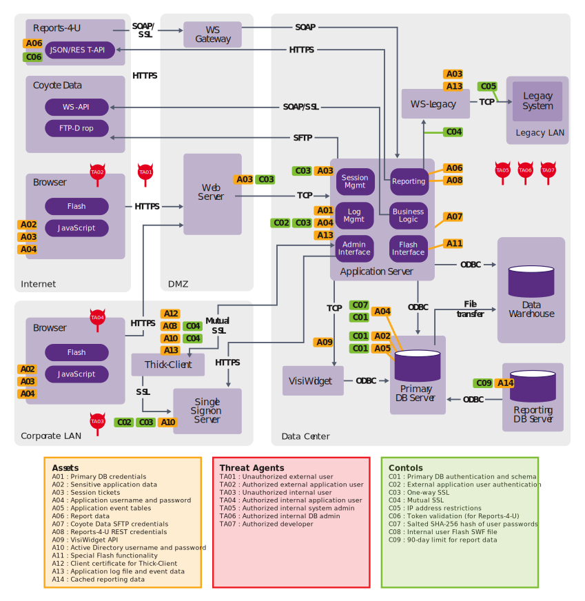
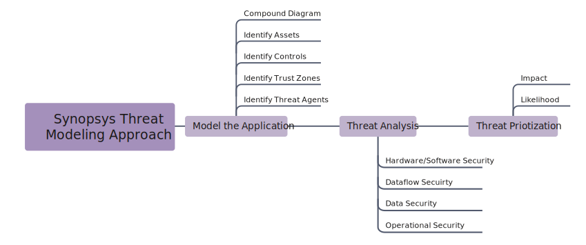

# Guide

Example:

## Process

High-level approach

As the figure below shows, the high-level approach to threat modeling adheres to the following steps:

Model the system.
Conduct a threat analysis.
Prioritize the threats.

### Model the system
System modeling consists of two parts:

Creating a component diagram with a control flow graph (which shows all possible execution paths in a program)
Identifying assets, security controls, trust zones, and threat agents

## Categories

### Assets

### Threat Agents
Test
### Controls